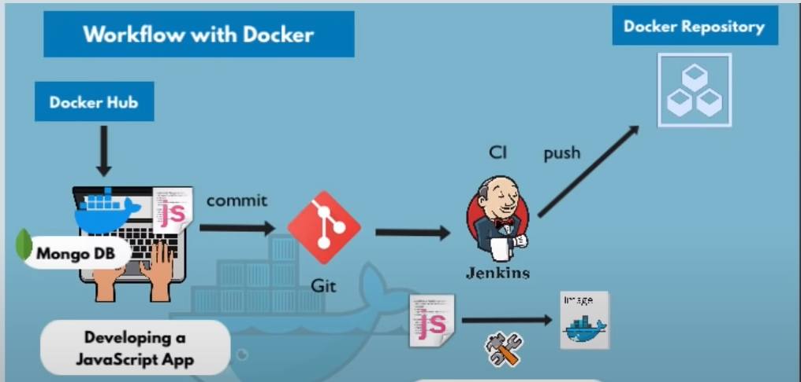
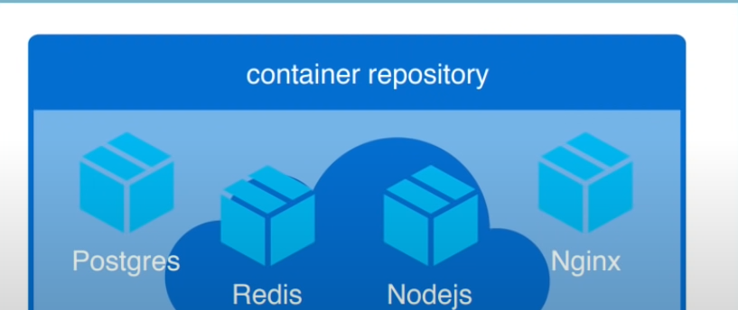
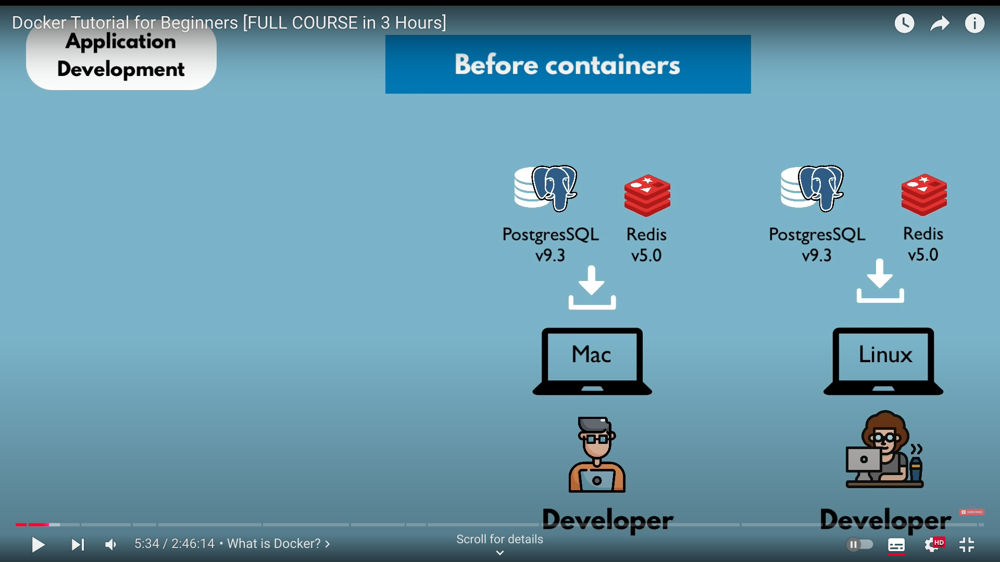
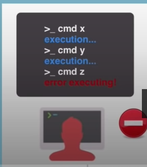
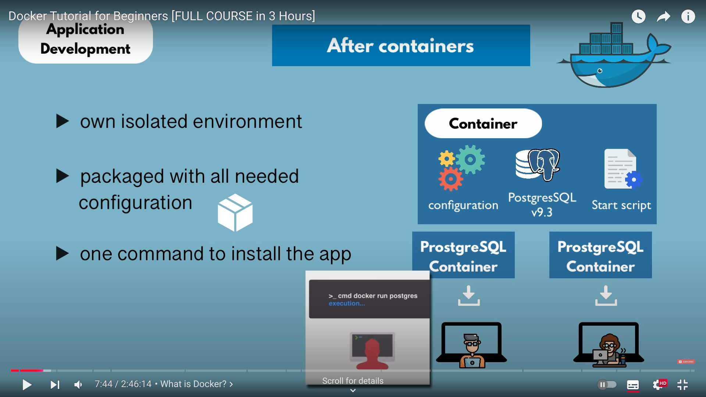

 
 

# `# Docker Tutorial for Beginners  # `

 

[Docker_Tutorial_For_Beginners](https://www.youtube.com/watch?v=3c-iBn73dDE)

 

# Docker OverView

- What is Docker and What is a container
- Docker Vs Virtual Machine 
- Main Commands 
- Debugging a Container 
- Developing with Containers
- Docker Compose - Running Multiple services
- DockerFile - Building own docker Image
- Private Docker Repository (AWS)
- Deploying the containerized app
- Volume - persisting data
- Volume Demo

# Transcript:
## Introduction 
- Hello and welcome to this complete Docker course by the end of this course you'll have a deep understanding of all the main Concepts and also a great big picture overview of how `Docker` is used in the whole software development process the course is a mix of animated theoretic explanations but also Hands-On demos for you to follow along so get your first hands-on experience and confidence `using Docker` in your projects. So let's quickly go through the topics I'll cover in this course we will start with the basic concepts of what Docker actually is and what problems it solves.
- we'll understand the difference between Docker and virtual machine and we will go through all the main Docker commands to `start and stop containers debug containers` Etc after that we'll see how to use Docker in practice by going through a complete workflow with a demo project so first we'll see how to develop locally with containers then we'll run multiple containers or services with Docker compos we'll build our own Docker image with Docker file.
- we'll push that built image into a private Docker repository on AWS and finally we'll deploy our containerized application last but not least we'll look at how to persist data in Docker learning the different volume types. 

     

# What is a Container and what problems does it solve?

 - `a container` is a way to package applications with everything they need inside of that package including the dependencies and all the configuration necessary and that package is portable just like any other artifact is and that package can be easily shared and moved around between a development team or development and operations Steam and that portability of containers plus everything packaged in one isolated environment gives it some of the advantages that makes development and deployment process more efficient.

 
# Where do containers live ?

- I mentioned containers are portable so there must be some kind of a storage for those containers so that you can share them and move them around so containers live in a container repository this is a special type of storage for containers many companies have their own private repositories where they host or the where they store all the containers and this will look something like this where you you can push all of the containers that you have. 

 

 there is also a public repository for Docker containers where you can browse and probably find any application container that you want so let's head over to the browser and see how that looks like so if I here search for a `DockerHub` which is the name of the public repository for Tucker I will see this official website so here if you scroll down you see that there are more than 100,000 container images of different applications hosted or stored in this Docker repository so here you see just some of the examples
(04:15) and for every application there's this official Docker container or Docker container image um but if you are looking for something else you can search it here and I see there's an official image for let's say Jenkins uh but there's also a lot of non-official images or container images that developers or or even from Jenkins itself that they actually store it here so public repository is where you usually get started when you're using or when you're starting to use the containers where you can find any application image. 

# How containers improved the development process by specific examples and How did we develop application before containers??

- usually when you have a team of developers working on some application you would have to install most of the services on your operating system directly right for example you are developing some JavaScript application and you need a postgres sql and you need red for messaging and every developer in the team would then have to go and install the binaries of those services and configure them and run them on their local development environment and depending on which operating system they're using the installation process will look actually different also another thing with installing services like this is that you have multiple steps of installation so you have a couple of commands that you have to execute and the chances of something going wrong and error happening is actually pretty high because of the number of steps required to install each service and this approach or this process of setting up a new environment can actually be pretty tedious depending on how complex your application is for example if you have 10 services that your application is using then you would have to do that 10 times on each operating system environment. 

 

# How to solve some of these problems with Containers?

-  you actually do not have to install any of the services directly on your operating system because the container is its own isolated operating system layer with Linux based image as we saw in the previous slides you have everything packaged in one isolated environment so you have the postgresql with a specific version packaged with the configuration and the start script inside of one container so as a developer you don't have to go and look for the binaries to download on your machine but rather you just go ahead and check out the container repository to find that specific container and download on your local machine and the download step is just one Docker command which fetches the container and starts it at the same time and regardless of which operating system you're on the command the docker command for starting the container will not be different it will be exactly the same so if you have 10 applications that your JavaScript application uses and depends on you would just have to run 10 Docker commands for each container and that will be it which makes the setting up your local development environment actually much easier and much more efficient than the previous version also as we saw in the demonstration before you can actually have different versions of the same application running on your local environment without having any conflict. 

# how containers can improve the deployment process before the containers? 

- In a traditional deployment process, the development team creates artifacts (like a .jar file for an application) and writes instructions on how to install and configure them on a server. These artifacts and instructions are then handed off to the operations team, which sets up the server environment to deploy the application. However, this approach has some issues:

    1.  Everything must be installed and configured directly on the server’s operating system, which can lead to dependency conflicts when multiple services are running.
    2. Misunderstandings can arise between developers and operations due to unclear instructions. If something is missed or misunderstood, the two teams have to go back and forth to resolve issues, delaying deployment.
- With containers, this process is simpler. Developers and operations work together to package the application and all its dependencies into a single container image, eliminating the need for server-side configuration. All that's required to deploy the application is to install Docker on the server once, then pull and run the container image from a repository. This makes deployment faster and more reliable by reducing configuration needs and potential misunderstandings.

#  what a container is technically ??

- Containers are built from layers of images, typically starting with a small Linux-based image (like Alpine) as the base to keep the container size small. On top of this base, you add the application and any necessary configuration layers. This layered structure allows Docker to only update or download parts that have changed when a new version of the application is needed, making it faster and more efficient.

For example, to use Docker, you can pull and run an official PostgreSQL image from Docker Hub. You can choose a specific version, like 9.6, by specifying it in the command. Docker will first check if the image is already on your local machine. If not, it will download each layer from Docker Hub and then start the application immediately.

Once the download is complete, you can use docker ps to see running containers, confirming that PostgreSQL is up and ready to accept connections.

# Difference between Container and Image?

-In Docker, an image is a packaged application with all its necessary configurations and dependencies. It’s like a blueprint or file that can be moved around, but it doesn’t do anything by itself.

A container is what you get when you actually pull the image to your local machine and run it, which starts the application inside and creates an active environment.

For example, if you download and start PostgreSQL 9.6, you’ll have a container of that version running on your machine. You can even run multiple versions (like PostgreSQL 9.6 and 10.10) at the same time without conflict. Docker will reuse any layers that are the same between versions, saving time.

This setup shows how flexible Docker is, allowing you to run different versions of the same application on your local machine easily.

# Docker Vs Virtual Machine (VM)

Docker and VirtualBox are both tools for virtualization, but they work differently.

An operating system has two main parts: the kernel and the application layer. The kernel is the core part that talks to the hardware (like CPU and memory). Applications run on top of this kernel.

In Docker, multiple applications can run in containers on the same kernel, so they share the same core system. This makes Docker lightweight because it doesn’t need a separate operating system for each application.

In contrast, VirtualBox uses virtual machines (VMs) that each have their own operating system and kernel. This makes VMs more resource-heavy because they act like complete, separate computers with their own OS.

So, Docker is more efficient for running multiple applications on one system, while VirtualBox is useful if you need completely separate OS environments.

# so the question here is what parts of the operating system they virtualize?

- Docker virtualizes only the applications layer. When you download a Docker image, it includes the applications layer and apps on top, but it uses the kernel (core part) of your computer’s operating system. This makes Docker images small and quick to start because they don’t need a full operating system—just the application and configurations.

- In contrast, VirtualBox (or virtual machines) virtualizes the entire operating system, including both the applications layer and its own kernel. This makes virtual machine images larger (several gigabytes) and slower to start because they have to boot up a full OS.

Because of these differences:

1. Docker images are smaller and faster to run.
2. Virtual machines can run any OS on any host OS, while Docker images rely on the host OS’s kernel.
- For example, if you try to run a Linux-based Docker image on an older Windows system, it may not work if the Windows kernel isn’t compatible. A workaround for this on older systems is Docker Toolbox, which helps to run Docker images even if the host OS kernel isn’t directly compatible.

# Docker Installation:

## Installationg for Mac:

This  explains how to install Docker on different operating systems, with specific steps for each OS and version. First, it shows you how to check if your OS meets the requirements for Docker. Links to important documentation and sections of the video are in the description.

Key points include:

**Docker Versions**: There are two Docker editions, Community and Enterprise. The Community Edition is suitable for most users.

**System Requirements**: Docker has certain requirements, especially for Mac and Windows. If your Mac or Windows doesn’t meet these, you may need to use Docker Toolbox as a workaround.

**Mac Installation**:

- Download Docker from the “Stable” channel.
- After downloading, drag the Docker app into your Applications folder.
- Start Docker, and you’ll see its icon in the menu bar. From there, you can view the status and manage settings.
**Windows Installation**:

- Docker works natively on Windows 10 and above. For older versions, use Docker Toolbox.
- Multiple User Accounts: On Mac, if you have multiple user accounts, you might face errors running Docker on multiple accounts at the same time. Switch accounts only after quitting Docker on the first account.

This  offers step-by-step guidance for installing Docker on different systems, with tips to avoid common issues.

# Windows Installation 

## To install Docker on Windows:

**Check Requirements**:

 1. Make sure your Windows version is compatible with Docker.
 2. Ensure virtualization is enabled. You can check this by opening Task Manager, going to the Performance tab, selecting CPU, and looking for the virtualization status.
Download and Install:

**Download and Install**:

 - Download Docker for Windows from the “Stable” channel.
- Run the installer and follow the steps in the installation wizard.
**Start Docker**:

**After installation**, search for the Docker app in Windows, click on it to start, and you’ll see the Docker whale icon appear, indicating that Docker is running.
  And that’s it—Docker is now installed and ready to use on your Windows machine.

#  Docker Installation for Linux

- **Check Requirements**: First, review the specific operating system and hardware requirements for your Linux distribution to make sure it can run Docker.

- **Uninstall Old Versions**: If you’ve installed Docker before, remove old versions (if it’s your first time, skip this step).

- **Install Docker from Repository (Recommended)**:

**Set Up Docker Repository**: The setup differs slightly for each distribution. Generally:
  1. Update your package manager.
  2. Set up a secure HTTPS connection to Docker’s official repository.
  3. Add Docker’s GPG key (for Ubuntu/Debian).
  4. Enable the stable Docker repository (Edge is optional but typically not recommended for stability).
**Install Docker**: Once the repository is ready, update your package manager and install Docker CE (Community Edition) using a single command.
**Verify Installation**: After installation, run a quick test using:

## Copy code
**sudo docker run hello-world**
This command downloads and runs a simple Docker image to confirm everything is working.

These steps give you a stable Docker setup on Linux, ready for running containers.

# Docker ToolBox

so as I mentioned previously for environments um that do not support running Docker natively there is an workaround which is called Docker
(38:17) toolbox so Docker toolbox is basically an installer for Docker environment setup on those systems so this is how to install uh Docker toolbox on your Mac um this is the whole package that comes with the installation of Docker toolbox which is basically the docker command line Docker machine Docker compose basically all the packages that we saw in the native installation and in on top of that you also get the Oracle VM virtual box so in order to install the docker toolbox it's actually pretty straightforward on this
(38:54) website you can go to the toolbox releases where we have all the leas of latest releases you just take the uh latest release and here you see two assets this one is for Windows obviously and you just download the package for mac and once it's downloaded you just click on it and go through the installation wizard leave all the options by default as they are do not change anything and after the installation you can just validate that the installation is successful and you can actually run Docker so so after
(39:28) seeing the installation was successful screen just go and look up in your launch pad dock quick start terminal and once you open it you should be able to run uh Docker commands and you can just try Docker run hello world which should just start up or bring up um this hello world Docker container on your environment so now let's see how to install Docker toolbox on Windows here see that you get the whole package of Docker Technologies with a toolbox which are basically the same package which you get on the uh Native Docker installation
(40:06) and on top of that you get Oracle VM virtual box which is the tool that enables Docker to run on an older system so before you install Docker tool books you have to make sure that you meet some of the preconditions number one you have to make sure your Windows system supports virtualization and that virtualization must be enabled otherwise Docker Docker won't start so depending on which Windows version you have looking up or checking the virtualization status will be different so I just suggest you Google it and look
(40:41) it up of how to find the virtualization status to see that it's enabled once you have that checked also make sure that your Windows operating system is 64 bits so if those two criteria are met then you can go ahead and install the Locker toolbox the place where you see the releases or the release artifacts is toolbox releases link here which I have open so it's basically a list of the releases you just take the latest one which has two artifacts this is the one for Windows you just download this executable file click on it and go
(41:17) through the installation wizard once the installation is completed there are just couple of steps here you can verify that Docker was installed or the toolbox was installed by just looking up the docker quick start terminal on your windows that app must be installed and once you click on it and open it you should be able to run Docker commands in the terminal so the basic Docker command that you can test will be Docker run hello world which will just fetch this basic uh Docker container from the public registry and
(41:50) run it on your computer if that command is successful it means that Docker was successfully installed on your computer and now you can proceed with the tutorial so in this video um I'm going to show you some basic Docker commands at the beginning I'm going to explain what the difference between container and images because that's something a lot of people confuse then very quickly go through version and tag and then show you a demo of how to use the basic Docker commands um commands that will be
(42:25) enough to pull an image locally to start a container to configure a container and even debug the container so with that said let's get started so what is the difference between container and image mostly people use those terms interchangeably but actually there is a fine difference between the two to see theoretically container is just the part of a container runtime so container is the running environment for an image so as you see in this graphic the application image that runs the application could be postgress redis
(43:04) some other application needs let's say a file system where it can save the log files or where it can store some configuration files it also needs some environmental configuration like environmental variables and so on so all of this environmental stuff are provided by container and container also has a Port that is binded to it uh which makes it possible to talk to the application which is running inside of a container and of course it should be noted here that the file system is virtual in container so the container has its own
(43:42) abstraction of an operating system including the file system and the environment which is of course different from the file system and environment of the host machine so in order to see the difference between container and image in action let's head over to the docker Hub and find for example a rice image another thing is that dockerhub all the artifacts that are in the docker Hub are images so we're not talking about containers here all of these things are images Docker official image so we're going to go ahead and pull a rad image
(44:23) out of the doah Hub to my laptop so you see the different layers of the image are downloaded and this will take a couple of minutes so once the download is complete I can check all the existing images on my laptop using Docker images command so I see I have two images radi and postgress with text image IDs and so on another important aspect of images is that they have texts or versions so for example if we go back to the docker Hub each one each image that you look up in the docker Hub uh will have any different
(45:14) versions the latest is always the one that you get when you don't specify the version of course if you have a dependency on a specific version you can actually choose the version you want and specified and you can select one from here so this is what you see here the tag is basically the version of the image so I just downloaded the latest and I can also see the size of the image so now to this point we have only worked with images there is no container involved and there is no redish running so now let's say I need red running so
(45:55) that my application can connect to it I'll have to create a container of that redice image that will make it possible to connect to the redis application and I can do it by running the redis image so if I say Docker Run Red this will actually start the image in a container so as I said before container is a running environment of an image so now if I open a new tab and do Docker PS I will get status of all the running Docker containers so I can see the container redis is running with a container ID based on the image of redis
(46:46) and some other information about it for example the port that it's running on and so on so as you see here the docker run redis command will start the redis container in the terminal um in an attached mode so for example if I were to terminate this with the control C you see that red application stops and the container will be stopped as well so if I do Docker PS again I see that no container is running so there is an option for Docker run command that make makes it able makes it possible to run the container
(47:30) in a detached mode and that is minus D so if I do dock run minus D redis I will just get the ID of the container as an output and the container will stop running so if we check again Docker PS I see the container with the ID starting with 838 which is the same thing here is running so this is how you can start it in the detached mode now for example if you would want to restart a container because I don't know some uh the application crashed inside or some error happened so you want to restart it you would need the doc container ID so
(48:12) just the first part of it not the whole string and you can simply say Docker stop ID of the container and that will stop the docker container nothing running if you want to start it again you can use the same ID to start again so let's say you stop Docker container at the end of the day you go home you come back the next day open your laptop and you want to restart the stopped container right so if you do Docker PS there is uh the output is empty you don't see any containers so what you can do alternative to just
(49:00) looking up your history command line history is you can do Docker PS minus a which will show you all the containers which uh are running or not running so here you see the container ID again and you can restart it okay so let's try another thing let's say you have two parallel applications that both use redish but in different versions so you would need two redish containers with different image versions running on your laptop right at different times maybe or at the same time so here we have the latest one
(49:44) which is radius 56 and let's head over to the dockerhub and select uh version let's say you need version 4 o so remember the first time that we downloaded the redis image we did Docker pull redis um however if you run Docker if you use Docker run with redice image and the tech which was 4.
(50:18) 0 it will pull the image and start the container right away after it so it does two commands basically in one so it's Docker pole that Docker start in one one command so if I do this it says it can't find the image locally so it goes and pulls the image from the repository to my laptop and again we see some layers are downloaded and the container is started right away and now if I do Docker PS you see that I have two radices running so this is where it gets interesting now how do you actually use any container that you just started so in this output we you also see the ports
(51:07) section which specifies on which Port the container is listening to the incoming requests so both containers open the same port which is what was specified in the image so in the logs of the container you can see the information running mode stand loone Port 6379 so how does that actually work and how do we not have conflicts while both are running on the same port so to explain that let's head over to our slide and see how this works as you know container is just the virtual environment running on your host and you
(51:50) can have multiple containers running simultaneously on your host which is your laptop PC whatever you working on and your laptop has certain ports available that you can open for certain applications so how it works is that you need to create a so-called binding between a port that your laptop your host machine has and the container so for example in the first container part here you see container is listening on Port 5000 and you bind your laptops Port 5,000 to that containers now you will have conflict if you open two 5,000
(52:36) ports on your host because you will get a message the port is already bound or is already in use you can do that um however you can have two containers as you see the second and third containers are both listening on Port 3000 which is absolutely okay as long as you bind them to two different ports from your host machine so once the port binding between the host and the container is already done you can actually connect to the running container using the port of the host so in this example URI you would have some app Local Host and then a port
(53:18) of the host and the host then will know how to forward the request to The Container using the port binding so if we head back here you see that containers have their ports and they're both running on the same one however we haven't made any binding between my laptop's port and the container port and because of that the container is basically unreachable by any application so I won't be able to use it so the way we actually do that is by specifying The Binding of the ports during the Run command so I'm going to
(54:00) break this and check that there is just one container running now I'm going to stop the other one as well so we can start the menu okay so we see both containers are here so now we want to start them using The Binding between the host and the container ports but again we have two Rices so we need to bind them to two different ports on my laptop so the way to do it is you do Docker run and you specify with minus P the port of the host that's the first one so let's go with 6,000 it doesn't really matter in this case and the
(54:48) second one is the port that you're binding this two which is the container Port so we know the container Port will be 6379 and this is where we bind our so my laptop's port 60002 and if I do this I forgot ra here so and now if I do Docker PS let's actually clean this Docker PS again here you see The Binding here all right so your laptops 6,000 Port is bound to the containers 6 37 9 so now let's do another thing and let's start it in a detached mode so like this let's check again it's running again and now I want
(55:49) to start the second container let's clear this again so here you see it created a bunch of containers because uh when I specified different options with the port binding it actually created new containers um that's why you see a couple of more here so I'm going to copy the image name with the tag for uh.
(56:19) o minus P so for example if I were to do this now and I would try to run the other redis the second redis container with the same port on my laptop I would get an error saying Port is already allocated so I can do 60001 and run it again I'll run it in detached mode so that I'm see port and if I go go over here and say Docker PS I see that I have two different radi versions running both of them bound to different ports on my laptop and the containers themselves listening to request on the same port so so far we have seen a couple of
(57:21) basic Docker commands we have seen Docker pull which pulls the image from the repository to local environment we also saw run which basically combines Docker pull and Docker start pulls the image if it's not locally available and then starts it right away then we saw Docker start and Docker stop which makes it possible to restart a container if um you made some changes and you want to um create a new version which makes possible to restart a container if you need to um we also saw docu run with options the one option that we saw was D
(58:00) minus D which is detach so you can run the container in DET detached mode so you can use terminal again minus P allows you to bind Port of your host to The Container so very important to remember minus P then comes the port of your host and then comes the port of your um container whatever it might be we also saw doap PS doap PS minus a which basically gives you all the containers no matter if they're running currently or not we also saw Docker images which gives you all the images that you have um locally so for example
(58:44) if after a couple of months you decide to clean up your space and get rid of some stale images you can actually check them check the list and then go through them and uh delete them you can do the same with stale Docker containers that you don't use anymore or you don't need anymore you can also get rid of them so the final part of the docker basic commands are commands for troubleshooting which are very very useful if something goes wrong in the container you want to see the logs of the container or you want to actually
(59:15) get inside of container get the terminal and execute some commands on it so let's see Docker PS we have two containers running right now we don't have any out we don't see any locks here so let's say something um happens your application cannot connect to redies and you don't know what's happening so ideally you would want to see what logs radi container is producing right the way to do that is very easy you just say Docker locks and you specify the container ID and you see the locks you can also do
(59:52) the lock locks if you don't want to uh remember the container ID or to Docker PS all the time you can remember the name of the container and you can get the logs using the name so a little side note here um as we're talking about the names of the containers so here as you see when a container is created you just get some random name like this so you can name your containers as you want um using another option of the docker run which might be pretty useful sometimes if you don't want to work with the container
(1:00:25) IDs and you just want to remember the names um or if you just want to differentiate between the containers so for example let's create a new container from r4.0 image using a different name that we choose so I'm going to stop this container and I'm going to create a new one from the same image so let's run it in the detached mode Let's Open the port th000 1 2 6 3 7 9 and give the name to the container and let's call since it's the older um version let's call it red older and we need to specify the image
(1:01:15) so remember this will create a new container since we're running the docker one command again so if we execute this and check again we see the redis 4.0 image based container is created which is um a fresh new you can see in it created and the name is red is older and we can do the same for the other container so that we kind of know which uh container is what so I'll stop this one and I will use the same command here this will be the latest and I will call this radius latest and since find another Port so
(1:02:08) I'm going to run it and let's see so here I have two containers running now I know R is older R is latest so for example if the older version has some problems I can just do logs R is older and I can get get my locks so another very useful command in debugging is Docker exit so what we can do with Docker exit is we can actually get the terminal of a running container so let's check again we have two containers running and let's say there is some problem with the latest ready latest container and I want to get a
(1:02:51) terminal of that container and to maybe navigate a directory inside check uh the lock file or maybe check the configuration file or uh print out the environmental variables um whatever so in order to do that we use Docker exit command with minus t which stands for interactive terminal then I specify the container ID and I say in so I get the B and here you see that the the cursor changed so I'm in inside of the container as a root user and here if I say LS okay the data is empty I can also print out in which
(1:03:35) directory I am I can go to home directory see what's there um so I have my virtual file system inside of a container and here I can um navigate the different directories and I can check stuff I can also print all the environmental variables to see that something is set correctly um and do all kinds of stuff here and this could be really useful if you have a container with some complex configuration or if for example you are running your own application that you wrote in a container H and you have some complex configuration there um or some
(1:04:15) kind of setup and you want to validate that everything um is correctly set in order to exit the terminal you just do exit and you're out you can also do the same using the name again if you don't want to work with the IDS and you just want to remember the names of the container to make it easier you can do it with the name as well same thing since most of the container images are based on some lightweight Linux distributions you wouldn't have much of their Linux um commands or applications installed here for example you wouldn't
(1:04:52) have a curl or some other stuff so you were a little bit more limited in that sense so you can execute a lot of stuff from the docker containers for most of the debugging work um it should be actually enough so the final part to review the difference between Docker run and Docker start which might be confusing for some people let's revisit them so basically Docker run is where you create a new container from an image so Docker run will take an image with a specific version or just latest right as option or as an attribute with Docker
(1:05:32) start you not working with images but rather with containers so for example um as we saw Docker run has a lot of options you specify with minus D and minus P the port binding and then you have this name of the container and all this stuff so basically you tell Docker at the beginning what kind of container with what attributes name and so on to create from a specific image but once the container is created and you can see that using a con uh the command so for example here the last ones that we created and if you stop it and you want
(1:06:14) to restart it you just need to use the command do start and specify the container ID and when you start it the container will retain all the attributes that we defined when creating the container using Docker run so Docker run is to create a new container Docker start is to restart a stopped container so once you've learned the docker basic concepts and understood how it works uh it's important to see how Docker is actually used in practice so in software development workflow you will know you have this uh classical
(1:06:56) steps of development and continuous delivery or continuous integration uh and then eventually gets deployed on some environment right could be a test environment develop environment so it's important to see how Docker actually integrates in all those steps so in the next couple of videos I'm going to concentrate exactly on that so we're going to see some overview of the flow and then we're going to zoom in on different parts and see how Docker is actually used in those individual steps so let's consider a simplified scenario
(1:07:29) where you are developing a JavaScript application on your laptop right on your local development environment your JavaScript application uses a mongodb database and instead of installing it on your laptop you download a Docker container from the docker Hub so you connect your JavaScript application with the mongodb and you start developing so now let's say you develop the application first version of the application locally and now you want to test it or you want to deploy it on the uh development environment where a tester in your team
(1:08:07) is going to test it so you commit your JavaScript application in git or in some other version control system uh that will trigger a continuous um integration a Jenkins build or whatever you have configured and Jenkins build will produce artifacts from your application so first it will build your JavaScript application and then create a Docker image out of that JavaScript artifact right so what happens to this Docker image once it gets created by Jenkins build it gets pushed to a private Docker repository so usually in a company you
(1:08:50) would have a private repository because you don't want other people to have access to your image images so you push it there and now as a Next Step could be configured on Jenkins or some other scripts or tools that Docker image has to be deployed on a development server so you have a development server that pulls the image from the private repository your JavaScript application image and then pulls the mongodb that your JavaScript application depends on from a dockerhub and now you have two containers one your custom container and
(1:09:29) a publicly available mongodb container running on dev server and they talk to each other you have to configure it of course they talk and communicate to each other and run as an app so now if a tester for example or another developer logs in to a Dev server they be they will be able to test the application so this is a simplified workflow how Brer will work in a real life development process in the next videos I'm going to show you Hands-On demo of how to actually do all this in practice so in this video we are going
(1:10:11) to look at some practical example of how to use Docker in a local development process so what we're going to do is a simple demo of a JavaScript and nodejs application in the back end to simulate the local development process and then we're going to connect it to a Docker container with a mongodb database in it so let's get started so in this video we're going to see how to work with Docker containers When developing applications so the first step will be is we're going to develop a very simple UI backend uh
(1:10:46) application using JavaScript very simple HTML structure and nodejs in the back end and in order to integrate all of this in the database we are going to use a Docker container of a mongodb database and um also to make working with the mongodb much easier so we don't have to execute commands in in the terminal we're going to deploy a Docker container of a UI which is called the Express where we can see the database structure and all the updates that our application is making in the database so this development setup
(1:11:21) should give you an idea of um how Docker containers are actually used in development process so I've already prepared some very simple JavaScript application um so in order to see the code basically we have this index HTML that is very simple code and we have some JavaScript here and we're using nodejs backend that just serves that index HTML file and listens on Port 3000 so we have the server running here in the back end and we have the UI that looks like this so basically it's just a user profile page with some
(1:12:00) user information and user can edit their profile so if I for example change the name here um and if I change the email address and do changes like this I can save my profile and I have my updates here um however if I refresh the page of course the changes will be lost because it's just JavaScript no JS so there is no persistent compon component in this application so in order to have that which is actually how real life applications work you'll know that you need to integrate the application with a database so using that example I will
(1:12:37) try to Showcase you how you can actually use the docker containers to make the development process Easier by just pulling one of the databases and attaching it or connecting it to the application so in this case we're going to go with the mongodb application and uh in addition to mongodb contain container we're going to also deploy a mongodb UI which is its own container it's called Express where we can manage or see the database insights and updates from our application much easier so now let's see how that all
(1:13:15) works so in order to get started let's go to dockerhub and find our uh mongodb image so here let's go to  and we have mongodb here actually and the Express which is another dock container that we're going to use for the UI so first let's pull the mongodb official image so I I already have mongodb latest so pulling doesn't take longer on my laptop but you're going to need a couple of seconds probably and the next one we're going to pull is the docker Express which I also have I believe so
(1:14:08) let's see yes it's also fast so if I check locally I have mongod TB and Express images so the next step is to run both and Express uh containers in order to make the mongod DB database available for our application and also to connect the  Express with the mongod DB container so let's do the connection between those two first in order to do that we have to understand another Docker concept Docker Network so how it works is that Docker creates its isolated Docker Network where the containers are running
(1:14:54) in so so when I deploy two containers in the same docken network in this case  and Express they can talk to each other using just the container name without Local Host port number Etc just the container name because they're in the same network and the applications that run outside of doer like our nodejs which just runs from node server is going to connect to them from outside or from the host using Local Host and the port number so later when we package our application into its own Docker image what we're going to have is again Docker
(1:15:36) network with mongodb container Express container and we're going to have a nodejs application which we wrote including the index HTML and JavaScript for front end in its own doc container and it's going to connect to the mongodb and the browser which is running on the host but outside the docker network is going to connect to our JavaScript application again using host name and the port number so Docker by default already provides some networks so if we say Docker Network LS we can already see these autogenerated Docker networks so we have
(1:16:17) four of them with different names and the drivers we're not going to go into details here but what we're going to do is create its own network for the mongodb and the Express and we're going to call it Network so let's do this right away going to say Docker Network create and we are going to call it Network so now if I do dock Network LS again I see my docken network has been created so now in order to make our m B container and the Express container run in this Network we have to provide this network option when
(1:17:03) we run the container in the docker run command so let's start with the so we all know that Docker run is the command to start a container from an image right so we have Docker run which is the basic Docker run command however in this case we want to specify a couple of things um as you learned from the previous videos you have to specify something called Port so we need to open a port of mongodb the default Port of mongodb is 27,7 so we will take that Port actually for both host and container so will run at this port inside of a
(1:17:46) container and we open the same port on the host so that will take care of the port then we will run it in a detach mode in addition to that there are a couple of things that we can specify when starting up the container and these are environmental variables of the mongot TB let's see um in the official image description you actually have couple of documentation about how to use the image which is very helpful to kind of understand what kind of configuration you can uh apply to it here you see some environmental variables so basically on
(1:18:21) Startup you can Define what the root username and the password will be which is very um handy because we're going to need those two for the express to connect to the and you can also specify the init database we're just going to provide the username and password because we can create the database from the Express UI later so let's do that and the way you can specify the environmental variables you can actually see here as well is by just let's copy this one so here you say environmental variable that's what the
(1:18:57) minus E Flex stands for and root username we'll say it's admin and another variable which is the password will be just password so in this way we can actually overwrite what the default username and password will be so two more things that we need to configure in this uh command our container name because we're going to need that container name to connect with the Express so we'll call this one  DB let's say and another one we need is the network that we created which was called  Network so in order to make this
(1:19:42) command a little bit more structured do it on multiple lines so let's see so it's more readable so basically all the options or all these flags that we set um to go one more time through them it it's going to start in detached mode uh we are opening the port on the host um username and password that we want mongodb to use uh in the startup process we're going to rewrite or overwrite the name of the container and this container is going to run in a Network and this should actually start the container
(1:20:28) okay so if you want to see whether it was successful we can log the container and see what's happening inside so as we see was started and everything actually looks good waiting for connections on Port 27,7 okay so now let's start Express we want Express to connect to the running mongod DB be container on Startup and here we have an example of how to run it and here we have the list of environmental variables that we can configure so let's quickly look at them username password we don't need them however we need the admin username
(1:21:12) and admin password of the motb this is actually what we overwrote with admin and password so we're going to use them because Express will need some username password to authenticate with the mongodb and to connect it the port is by default the correct one so we don't need to change that um and this is an important part this is the mongodb server right so basically this is the container name that Express will use to connect to the docker and because they running in the same network only because of that this configuration will work if
(1:21:47) I didn't if I hadn't specify the network then I could have I could specify the name correct name here of the container but it wouldn't work so with that said let's actually create the docker run command for Express as well so let's clear the history and let's start so again we run it in detached mode and let's see what parameters we need so first of all Port let's say what is the default Port that the express runs on that's 80 81 so we'll take that so basically it's
(1:22:24) going to run on our laptop on Port 8081 the next option would be these two and remember environmental variables need to be specified with minus E and this is the username of mongodb admin which is admin because we specified it when we started the mongodb container this is the password let's set this one as well don't forget the network minus minus net  Network we have the name we can also call it Express and let's see what else we might need here yes this is important one um and our container name let's actually
(1:23:22) see it again toer PS the one running it's called mongodb that's the container name and this is what we need to specify here so I'm going to write this here and finally the image is called Express so I'm just going to copy this one here and that is it so basically with these commands do Express should be able to connect to the mongod Deb container so let's run it and just to make sure let's log the container and see what's happening there waiting for mongodb welcome to  express it looks like it connected
(1:24:02) successfully um it says here database connected and the Express is available at Port 8081 so let's check the Express out at the Port 881 so actually let's close these tabs we don't need them anymore and here if I say Local Host 881 I should be able to see the manga Express so these are the databases that already exist by default in or which are created on Startup and using the UI we can create our own database as we saw previously we could have specified an environmental variable init DB on mongodb Startup and that would
(1:24:47) have created a new database however it doesn't matter we will just create a database name here so we will call it user um account database so let's create one and now we can actually use it or connect to this database from node.js so let's see how that works so now we have the mongodb container and the Express container running so let's check that we have both of them we'll have to connect nodejs with the database so the way to do it is usually to give a protocol of the database and the URI and the URI for
(1:25:31) a mongodb database would be Local Host and the port that it's accessible at I already went ahead and prepared the code for node.js so basically we are going to use a client here which is a node module and using that client we are connecting to the mongodb database so this is the protocol the host and the port that we just saw that the mongodb is listening at and username and password of the root user of mongodb of course usually you wouldn't put the password here or not use an admin or root uh username password to connect to
(1:26:10) a database but this is for just the demonstration purposes and these are username and password that we set as environmental variables when we created the docker mongodb container so let's check that so this is the mongodb uh container command and this is the username root and root password that we specified and this is what we are going to use in the code as I said for demonstration purposes I will write the password directly here so then we connect to the database um so I also went ahead and in the Express user
(1:26:50) account database and inside that I created collection which is like a table in my SQL world called users so here I connect to user account database and I query The Collection users and this is a get request so I'm just fetching something from the database and this is update uh request same thing I connect to the database using the same URI and the database name and I update or insert something in the collection so now let's see how all that works so let's head over to the UI so in the users collection there is no data it's empty
(1:27:28) so we're going to refresh it and edit the data so I'm going to write here some and update and refresh we see that a new insert was made so this is the update profile section here so all this was executed it connected to the mongodb and now we have one entry which is email coding name that we changed so if I'm going to refresh it now I fetched the newly inserted user data in the UI and I displayed it here and also if you want to see what the mongod container actually logs during this process we can
(1:28:08) actually look at the logs so I'm going to say docks and log using the container ID so let's say if I wanted to see just the last part of it because I want to see what the last activity was I can also let's clear this and I can also do tail so I can just display the the last part of it or if I want it I could also stream the logs so I'll clear this again and I'll say stream the logs so I want have to do dockal logs all the time so if I make a line here for example to Mark the last logs I can refresh it let's make some
(1:28:49) other changes let's change it to own and save profile so I'm going to see some activity here as well so these connections are new and it also says received client metadata and this is where the nodejs request comes in with the nodejs and its version and at the end of each communication there is an end connection because we end the database connection at the end so we see that also in the logs so if for example something wasn't working properly you could always check them in the logs here so with that I have a fully
(1:29:29) functional JavaScript nodejs application which has a persistence in the mongodb database and we also have uh UI both of them running in a Docker container so this would be uh somehow an realistic example of how local development using Docker containers would look like so in the last video we created and started two Docker containers mongodb and Mong Express and these are the commands that we used to make it happen right the first we created a network where these two containers can can talk to each other using just the container
(1:30:08) name and no host Port Etc is necessary for that um and then we actually ran two Docker run commands with all the options and environmental variables Etc set now uh this way of starting containers all the time is a little bit tedious and you don't want to execute these run commands all the time on the command line terminal especially if you have a bunch of Docker containers to run you probably want to automate it or just make it a little bit easier and there's a tool that's that makes running multiple
(1:30:45) Docker containers with all this configuration much easier than with Docker run commands and that is Docker compose if you already know Docker comp post and you are wondering why is it useful and what it actually does then bear with me in the next slide I'm going to explain that so this is a Docker run command of the mongodb that we executed previously so basically with Docker compose file what we can do is we can take the whole command with its configuration and map it into a file so that we have a structured commands so if
(1:31:24) you have have let's say 10 Docker containers that you want to run for your application and they all need to talk to each other and interact with each other you can basically write all the Run commands for each container in a structured way in the docker compos and we'll see how that structure actually looks like so on the right side in the docker compos example the first two tags are always there right version three that's the latest version of the compose Docker compose and then we have the services this is where the container
(1:31:56) list goes so the first one is mongodb and that Maps actually to The Container name right this is going to be a part of container name when Docker creates a container out of this configuration blueprint the next one is actually the image right so we need to know which image that container is going to be built from and of course you can specify a version tag here um next to the name the next one one is Port so we can also specify which ports is going to open first one is on the host and the second one after the colum is on the container
(1:32:36) so the port mapping is there and of course the environmental variables can be also mapped in the docker compose and this is how actually the structure of Docker compose looks like for one specific commands let's actually see the second container command for Express that we executed it and how to map that so now again we have a Docker run command for Express and let's see how we can map it into a Ducker compose so as I said services will list the containers that we want to create and again names Express will map map
(1:33:14) to The Container name the next one will be the image again you can add a tag here if you want to be um have a specific one then you have the ports 80 to 8080 and then you have all the environmental variables again under the attribute environment and this is how the docker compose will look like so basically Docker compos is just a structured way to contain very normal common Docker commands and of course it's it's going to be easier for you to edit the the file uh if you want to change some variables s if you want to
(1:33:54) change the ports or if you want to add some new options to the Run command so to say and maybe you already noticed the network configuration is not there in the docker compost so this Network that we created we don't have to do it in a Docker compose we go to the next slide because we have the same concept here we have containers that will talk to each other using just the container name so what docker compose will do is actually take care of creating a common Network for these containers so we don't
(1:34:31) have to create the network and specify in which network these containers will run in and we're going to see that in action right away so let's actually create a Docker compost file so I'm going to paste all my contents here and this is exactly what we saw on the slide and I'm going to save it as a  yl and we see the highlighting as well be very aware of the indentation they have to be correct so this is the list of all the containers on the same level and then each container has its configuration inside
(1:35:17) that so now compared to Docker run commands it will be very easy for me to go here and change these environment variables or add some new configuration options Etc so here again for demonstration we actually save the docker compose in the code so it's part of the application code so now that we have a Docker compose file the question is how do I use it or how do I start the containers using that so let's go to the command line and start Docker containers using this Docker compose file so the way to use it is using Docker
(1:35:56) compose command now if you've installed Docker on your laptop it usually gets installed with the docker compose packaged inside so you should have both Docker and Docker compose commands installed as a package so Docker compos command takes an argument which is the file so I'm going to specify which file I want to execute and in my case it's called yl and and at the end I want to say what I want to do with this file in this case the command is up which will start all the containers which are in the yl so let's
(1:36:36) actually check before that there there are no containers running so I don't have anything running here and I'm going to start those two containers okay so there are couple of interesting things here in this output so let's scroll all the way up so we've talked about Docker Network and how we created our own network at the beginning to run the containers inside and I said the docker compos takes care of it and here we see the output where it actually created a network called my app default this is the name of the network and it's
(1:37:19) going to run those two containers these are actually the names of the containers the do compos created this is what we specified and it just added prefix and suffix to it and it created those two containers uh in that Network so if I actually go here and do Docker Network LS I see the my app default is here so that's one important thing another one is that logs of both containers actually mixed because we are starting both at the the same time as you see the Express has to wait for mongod DB to start because it needs
(1:38:02) to establish a connection so we here see the locks so mongodb is starting we still get connection refus because it's not started uh completely and somewhere here when mongodb is started and listening for connections  Express is able to connect to it so this is something that you can also do with Docker compose uh when you have two containers that where one depends on another one starting you can actually configure this waiting logic in the docker compos okay so now let's see actually that the docker containers are
(1:38:42) running so we have both of them here you see the container names that Docker compos gave them and one thing here to note is that the Express actually started on Port 8081 inside the container so we can see that here so we are opening a port 8080 on my laptop that actually forwards the request to container at port 8080 one just so that you don't get confused because it was 8080 on the slides so now that we have restarted the containers let's actually check the first one which is Express so it's running on
(1:39:27) 8080 in the previous example we created a database and the collection which is gone because we restarted the container this is actually another very important concept of containers to understand when you restart a container everything that you configured in that container's application is gone so data is lost so to say there is no data persistence in the containers itself of course that is very inconvenient you want to have some persistence especially when you're working with a database and there is a
(1:40:02) concept we're going to learn later called volumes uh that makes it possible to have persistency between the container restarts okay so let's actually create the database again because we need it and inside the database we had actually users collection let's create that one as well and that is empty now let's actually start our application and there you go so now if I were to modify this one here and update I should see the updated entry here so the connectivity with mongodb works so now what do I do if I
(1:40:54) want to stop those containers of course I could go there and say Docker stop and I can provide all the IDS as we did previously or with Docker compose it's actually easier I can do Docker compose again specify the file and instead of up I'm going to say down and that will go through all the containers and shut them all and in addition to remove removing the containers or stopping them removing the containers it also removes the network so the next time we restarted it's going to recreate so let's actually
(1:41:34) check that the network LS that default my app default Network case G and when I do up see it gets recreated that should give you a good idea of what dock compose is and how to use it the next we're going to build our own Docker image from our node.js JavaScript application so now let's consider the following scenario you have developed an application feature you have tested it and now you're ready to deploy it right to deploy it your application should be packaged into its own Docker container so this means that we are going to build
(1:42:20) an Docker image from our JavaScript no JS backend application and prepare it to be deployed on some environment to review this diagram that we saw at the beginning of the tutorial so we have developed a JavaScript application we have used the mongodb docker container to use it and now it's time to commit it to the git right so in this case we're going to simulate this steps on the local environment but still I'm going to show you how these steps actually work so after commit you have a continuous
(1:42:54) integration that runs so the question is what does actually Jenkins do with this application when it builds the application so the JavaScript application using the npm build Etc it packages it then in a Docker image and then pushes it into a Docker repository so we're going to actually simulate what Jenkins does with their application and how it actually packages it into a Docker image on the local environment so I'm going to do all this on my laptop but it's basically the same thing that Jenkins will do and then on
(1:43:33) later step we can actually push the built image into a Docker repository in order to build a Docker image from an application we basically have to copy the contents of that application into the docker file it could be an artifact that we built in our case we just have three files so we're going to copy them directly in the image and we're going to configure it and in order to do that we're going to use a blueprint for building images which is called a Docker file so let's actually see what is a Docker file and
(1:44:07) how it actually looks like so as I mentioned Docker file is a blueprint for creating Docker images a syntax of a Docker file is super simple so the first line of every Docker file is from image so whatever image you building you always want to base it on another image in our case we have a JavaScript application with no JS backend so we are going to need node inside of our container so that it can run our node application instead of basing it on a Linux Alpine or some other lower level image because then we would have to
(1:44:50) install node ourselves on it so we are taking a ready node image and in order to see that let's actually go to dockerhub and search node here and here you see there is a ready node image that we can base our own image from so here we have a lot of different text so we can actually use one specific one or we can just go with the latest if we don't specify any take so what that actually means basing our own image on a node image is that we're going to have node installed inside of our image so when we
(1:45:33) start a container and we actually get a terminal of the container we can see that node command is available because there's node installed there this is what from node actually gives us so the next one is we can configure environmental variables inside our Docker file now as you know we have already done this in the using the docker on commands or the docker compos so this will be just an alternative to defining environmental variables in a Docker compos for example I would say it's better to define the
(1:46:08) environmental variables externally in a Docker compos file because if something changes you can actually overwrite it you can change the docker compos file and override it instead of rebuilding the image but this is an option so this n command basically would translate to setting the environment of variables inside of the image environment the next one is run so all these Capital case words that you see from in and run they're basically part of a syntax of a Docker file so using run basically you can execute any kind
(1:46:47) of Linux commands so you see make directory is a Linux command that creat creates home slome app um directory very important to note here this directory is going to leave inside of a container so when I start a container from this image the slh home/ app directory will be created inside of the container and not on my laptop not on the host so all these commands that you have in Docker file will apply to The Container environment none of them will be affecting my host environment or my laptop environment so with run basically
(1:47:27) you can execute any Linux commands that you want so that's probably one of the most used ones and we also have a copy command now you would probably ask I can execute a copy command a Linux copy command using run yes you could but the difference here is that as I said all these commands in run for example they apply to they get executed in inside of the container the copy command that you see here it actually uh executes on the host and you see the first parameter is Dot and the second parameter is slome
(1:48:07) app so source and the Target so I can copy files that I have on my host inside of that container image because if I were to execute run CP Source destination that that command would execute inside of the docker container but I have the files that I want to copy on my host in the last one so from and CMD or command is always part of Docker file what command does is basically executes an entrypoint Linux command so this line with the command actually translates to node server JS so remember here we actually do node server JS so we start a
(1:48:53) node server with the nodejs this is exactly what it does but inside of the container so once we copy our server JS and other files inside of a container we can then execute node server.js and we are able to do it because we are basing on the Node image that already has node pre-installed and we are going to see all this inaction so another question here what is the difference between run and CMD because I could also say run node server.
(1:49:26) js the difference again is that CMD is an entry point command so you can have multiple run commands with different Linux commands but CMD is just one and that marks for Docker file that this is the command that you want to execute as an entry point so that basically runs the server and that's it so now let's actually create the docker file and just like the docker compos file Docker file is part of the application code so I'm going to create a new file here and I'm going to paste here the contents so again we're basing off Note image and actually
(1:50:09) instead of just having the latest node I'm going to specify a node version so I'm going to take 13 minus Alpine so all these that you see here are Texs so I can use any of them as a TCH so I'm going to say 13 minus Alpine like this so this is going to be a specific node image that I'm going to use as my base image let's actually stop here for a moment and take a little bit of a deep dive on this line so since we saw that Docker file is a blueprint for any Docker image that should actually
(1:50:51) mean that every docker ER image that there is on dockerhub should be built on its own Docker file right so if we actually go to Let's actually look at one of the latest versions which is 13 minus Alpine and let's click inside and as you see this specific image has its own Docker file and here as you see we have the same from that we just saw and this is what this node official image is based of which is a base image Alpine 3.
(1:51:29) 10 right and then we have this environmental variable set and all these Linux commands using run and some other environmental variable and you have this entry point which is a script so you can also execute the whole shell script instead of separate commands and you have this final Command right so you don't have to understand any of this I just want to demonstrate that every image is based of another base image right so in order to actually visually comprehend how this layer stacking works with images let's consider this simplified
(1:52:08) visualization so our own image that we're building app with a version 1.0 is going to be based on a node image with a specific version that's why we're going to specify from node 13 Alpine and the node 13 Alpine image as we saw in the docker file is based on Alpine base image with a version 3.
(1:52:32) 10 that's why it specifies from Alpine 3.10 so Alpine is a lightweight base image then we install node on top of it and then we install our own application on top of it and basically this is how all the images are built so now let's go back and complete our Docker file so we have the from specified we have the environmental variables specified and in just a second we're going to actually see these commands in action so let's copy that and this is also very important Docker file has to be called exactly like that
(1:53:08) you can just give it any name it is always called Docker file starting with a capital D and that's it it's a simple text file so just save it like this and here you even see the highlighting and this Docker icon so now that we have a Docker file ready let's see how to actually use it so how do we build an image out of it so in order to build an image using the docker file we have to provide two parameters one is we want to give our image a name in the tag just like all the other images have so we are going to do it
(1:53:49) using minus t so we are going to call our image my app and we're going to give it a tag of 1.0 the tag could be anything you can even call it actually version one it wouldn't matter so we're going to do 1 point0 and the second required parameter actually is a location of a Docker file because we want to tell Docker here build an image using this Docker file and in this case because we're in the same fold as the docker file we're just going to say current directory when we execute this we're going to see that
(1:54:29) image is built and this is an ID of the image that was built because I already have node 13 Alpine on my laptop this just use the the one I have lying around locally for you if it's the first time you will actually see that it's pulling node image from the dockerhub so now with the docker images I can actually see that my image is here it says created two days ago I don't know why but anyways so I have the image name which is this one here and I have the name of the image and the tag of the image so if we go
(1:55:11) back to this diagram that we saw in the review so basically we've got all these steps or we have simulated some of the steps we've built the JavaScript application using a Docker containers and one once the the application is ready let's say we made the commit and we we just simulated what Jenkins server also does so what Jenkins does is actually it takes the docker file that we create so we have to commit the docker file into the repository with the code and Jenkins will then build a Docker image based on the docker file
(1:55:49) and what is an important Point here is that usually you don't develop long you are in the team so other people might want to have access to that upto-date image of your application that you developed it could be a tester maybe who wants to pull that image and test it locally or you want that image to be deployed on a development server right and in order to do that you have to actually share the image so it is pushed into a Docker repository and from there either people can take it for example a tester maybe want to download the image
(1:56:23) from there and test it locally or a development server can actually pull it from there so let's actually just run a container I'm just going to say Docker run the image name obviously and a tag like this and in this case I'm not going to specify any other options because we just want to see what's going on inside of the container so I'm just going to run it okay so the problem is that it can't find the server JS file which is actually logical because we are not telling it to look in the correct
(1:57:03) directory so since we are copying all the resources in this home/ home/ app directory server JS is going to be there as well and this is another topic whenever you adjust a Docker file you have to rebuild an image because the old image cannot be over written so to say so what I'm going to do now is actually I'm going to delete the one that I built so I'm going to I'm going to actually take the image this is how you delete an image but I can delete it because as as it says the docker is used by a stopped
(1:57:42) container so if I do Docker PS minus a actually let's crap to my app like this I have to first delete the container so this is how you delete a container it's doer RM and once I've deleted the container I can delete an image so the image deletion is RMI like this so if I do images now I see my image isn't there okay so we' have modified the docker file so let's rebuild it now so Docker build again and let's see the image is here so let's start it again so it's my app 1.0 and let's run it and as you see the
(1:58:40) problem is fixed app listening on Port 3000 so our app is running so this one here I app 1.0 first of all we can see the logs here like this we see that the EP is listening on Port 3000 we know everything is cool to actually just get a little bit more inside let's enter the containers or let's get the terminal the command line terminal of the container and look around there so I'm going to say Docker exit interactive terminal I'm going to specify the container ID in like this and since bin bash doesn't work we can
(1:59:25) actually try shell so this is something you will also encounter because some containers do not have bash installed so we'll have to connect using bin sh so one of them has to work always so let's see in which directory we are so we are in the root directory and we see our virtual file system there and as you see the cursor changed as well so that means we're inside of a container so now let's actually check some of the stuff so first of all we specified some environmental variables here in the
(2:00:05) docker file and this means that these environmental variables have to be set inside the docker environment so if we do inv we actually see the mongodb username this one here and mongodb password are set and there are some other environmental variables automatically said we don't care about them so another thing we can check is this directory because remember because with this line we actually created this slome app directory so let's see slome Slash app and as you can see the directory was created and with the next
(2:00:46) Land We copied everything in the current folder so if we actually go and see reveal in finder so this is where the docker file resides so basically we copied everything that is inside of this directory so all of these into the Container now we don't actually need to have Docker file and Docker compose and uh this other stuff in here because the only thing we need are the JavaScript files or if we build a JavaScript application artifact just the artifact so let's go ahead and improve that so what I'm going to do is I'm going to
(2:01:27) create an app directory and I'm going to copy just the files that I'm going to need for starting an application inside of a container so I'm going to take those and the images as well so all these are just external ones we don't need them there and images the index HTML file package Jon server JS and node modules are inside of app so what we can do it now is instead of copying the whole directory where where the docker file is I just want to copy all the contents of EP folder so what I'm going
(2:02:07) to do is I'm going to say copy all the app contents and again because we modified a Docker file we need to recreate the image in order to leave the docker Container Terminal can actually exit so now we are on the host again so if I do Docker images again I have to first delete the container and then image but in order to delete the container I have to first stop it so now I can remove the container and now I can actually remove the image that the container was based on and let's check again so let's ex
(2:02:53) execute that build command again so now that we have the image built let's actually run it so I'm going to say my app 1.0 and of course I could have executed with a minus D in a detached mode it doesn't matter now and if I do a Docker PS I see my um image container running and now let's actually enter the container G so it and as we learned it was in sh and again we're going to see the home app and here we just have the contents of app directory so no unnecessary Docker file Docker compose Etc files
(2:03:47) which is actually how it's supposed to be or as I said because I just had a couple of files here I copied all of them but usually if you have this huge application you would want to compress them and package them into an artifact and then copy that artifact into a Docker image container okay but as I said this was just for demonstration purposes because I just wanted to show you um how you can actually start it as a container and how it should to look inside and in this case we improved a couple of things but
(2:04:21) usually we would start this container from a Docker compose as well together with all the other Docker images that the application uses and it's also doesn't have any ports open so uh this is just for demonstration purposes so in this video we're going to create a private repository for Docker images on AWS ECR there are many more options for Docker Registries among them Nexus and digital ocean so we're going to see how to create a registry there build and tag an image so that we can push them into that repository and in
(2:04:58) order to push the images into a private repository you first have to log into that repository so let's see how it all works so the first step is to actually create a private repository for Docker it's also called Docker registry in this case we're going to do it on AWS so let's see so I already have an account on AWS so the service that we're going to use is called elastic container registry so ECR doer container registry and because I don't have a repository there yet I am presenting with the screen so in order to create a
(2:05:48) repository click on get started and here we have a repository name and we're actually going to name it the name of the application that we have so I'm actually going to name it my app this is the domain of the registry from AWS and this is the repository name which is the same as my image name and don't worry about the other stuff right now and just create a repository it's as simple as that now one thing I think specific to Amazon container service is that here you create a Docker repository per image so
(2:06:28) you don't have a repository where you have where you can actually push multiple images of different applications but rather for each image you have its own repository and you go inside of the repository here it's empty now but what you store in a repository are the different tags or different versions of the same image so this is how the Amazon container service actually works there are other dep Docker Registries that work differently for example you create a repository and you can just throw all of your container
(2:07:00) images inside of that one repository so I think this is more or less specific for AWS so anyways we have repository which is called my app and let's actually see how we can push the image that we have locally so actually check that once more so we want to push this image here into that repository so how do we do that if you click on this one the view push commands will be highlighted this is different for each registry but basically what you need to do in order to push an image into repository are two things one you
(2:07:40) have to log in into the private repository because you have to authenticate yourself so if you are pushing from your local laptop or local environment you have to tell that private reposit hey I have access to it this is my credentials if a Docker image is built and pushed from a Jenkins server then you have to give Jenkins credentials to login into the repository so Docker login is always the first step that you need to do so here AWS actually provides a Docker login command for AWS so it doesn't say Docker login but in the
(2:08:20) background it uses one so I'm going to execute this login command for AWS Docker repository uh so in the background it uses actually Docker login to authenticate so in order to be able to execute this you need to have AWS command line interface and the credentials configured for it so if you don't I'm going to put a link to the guide of how to do that in the description I have configured both of them so I can execute this command and I should be logged in successfully to the docker repository so now I have
(2:08:57) authenticated myself to the docker repository here so I'm able to push the image that I have locally to that repository but before I do that there is one step I need to do so I've already built my image so that's fine and now I have to tag my image and if this command here looks a little bit too complicated for you or too strange let's actually go and look at image naming Concepts in Docker repositories so this is the naming in Docker Registries this is how it works the first part of the image name the
(2:09:38) image full name is the registry domain so that is the host Port Etc slash repository or image name and the tag now you may be wondering every time we were pulling an image out of dockerhub we actually never had this complex long name of the image right so when we were pulling an image it looked like this Docker pole 4.
(2:10:07) 2 the thing is with dockerhub we're actually able to pull an image with a short hand without having to specify a registry domain but this command here is actually a shorthand for this command what actually gets executed in the background when we say Docker pole is Docker pole the registry domain so docker.io library is a registry domain then you have the image name and then you have the tag so because we we were working with dockerhub we were able to use a shortcut so to say in a private Registries we can just skip that part because there is no
(2:10:43) default configuration for it so in our case in AWS ECR what we going to do is we're going to execute Docker pull the full registry domain of the repository this is what we're going to see here and a tag and this is how AWS just generates the docker registry name that's why we see this long image name with the tag here and we have to tag our image like this so let's go back and take a look at our images our image that we built again and under the repository it says my app now the problem is we can just push an image
(2:11:26) with this name because when we say Docker push my app like this Docker wouldn't know to which repository we're trying to push by default it will actually assume we're trying to push to dockerhub but it's not going to work obviously because we want to push it to AWS so in order to tell Docker you know what I want this image to be pushed to AWS repository with the name my app we have to tag the image so we have to include that information in the name of the image and that is why we have to tag the image tag
(2:12:07) basically means that we are renaming our image to include the repository domain or address and the name okay and AWS already gives us the command that we can execute we want to use the specific version so I'm going to use 1.0 in both so what this is going to do is it's going to rename this is what tech does my app 1.
(2:12:37) 0 this is what we have locally this is what the name is to this one here so let's execute that and let's see what the outcome is and as you see it took the image that we had it made a copy and renamed it into this one so these two are identical images they're just called in a different way and now when we go back we see the docker push command so basically this thing here is a same as Docker push and name of the image and the take so this push command will tell Docker you know what I want you to take the image with tag
(2:13:25) 1.0 and push it into a repository at this address so when I execute this command see the push command will actually push those layers of the docker image one by one this is the same thing as when we're pulling it we also pulled the images layer by layer and this is what happens in the reverse Direction when we push it so this is also going to take a little bit great so the push command was complete and we should be able to see that image in the AWS repository now so if I go inside see I have image tag with 1.0
(2:14:13) this is our tag here and push the time the digest which is the unique hash of that image and the image URI which is again the name of the image using the the repository address image name or repository name in this case and the tag so now let's say I made some changes in the docker file you know let's say I renamed this home slome to node app like this or what could also lead to need to recreate an image is obviously when I change something in the code right so you know let's say I were to delete this
(2:15:05) line because I don't want to console log to be in my code and now I have a different version of the application where I have changes in the application so now I want to have those changes in the new Docker image so now let's build a new Docker image out of it so Docker build let's call it my app with a version 1.
(2:15:40) 1 and a path to a Docker file and now I have a second image which is called my app with version 1.1 so now again because I want to push this to repository I have to rename it to include the repository address inside of it so I'm going to do Docker tag the first parameter is the image that I want to rename and the second one is the name of that image a new name so it's going to be the same as the previous one because the repository name and the address is the same remember we have one repository for one image but for different versions so
(2:16:25) we're building a version 1.1 so it should end up in the same repository so now here we have 1.1 and if I tag that and images I have a second image here so I'm going to copy that and I'm going to do Docker build and do not forget that tag it's important because because it's part of the complete name sorry it's Docker push and now some of the layers that I already pushed are there only the ones that changed are being rep pushed sort of say and also know that I just have to do Docker login once at the beginning
(2:17:13) and then I can pull and push images uh from this repository as many times as I want so do login is done once so now that is complete let's actually reload this so my repository now has two versions so this is pretty practical if you are for example testing with different versions and you want to have a history of those image Texs if you want to for example test a previous version and I think in AWS the repos each repository has a capacity of hold holding up to 1,000 uh image versions so for example my app here can have
(2:17:57) thousand different tags or of the same image okay so now going to compare it to the initial diagram that we saw for this complete flow let's actually switch back to it quickly so here what we did is basically simulate how Jenkins would push an image to a Docker repository so whatever we did on our lap top will be the same commands executed on a Docker on the Jenkins server and again Jenkins user or Jenkins server user has to have credentials to the docker repository to execute Docker login depending on the
(2:18:36) registry or repository configuration will look different and Jenkins needs to tag the image and then push it to the repository and this is how it it's done and the next step of course we need to use that image that is lying now in the repository and we're going to see how it's pulled from that repository and again we're going to do it on the local environment but it's the same thing that a development server or any other environment will actually execute so in this video we're going to
(2:19:09) see how to deploy an application that we built into a Docker image so after you package your application in a Docker image and save it in the private repository you need to somehow deploy it on a development server or integration server or whatever other environment and we're going to use Docker compose to deploy that application so let's imagine we have logged in to a development server and we want to run our image that we just push the repository so our my app image and the mongodb image uh both the database and the Express on
(2:19:51) the development server so the my app image will be pulled from private repository of AWS the in the two containers will be pulled from the docker Hub so let's see actually how that would work so usually again you have developed your application you done with it and you have created uh your own Docker image right now in order to start an application on development server you would need all the containers that make up that application environment okay so we have mongodb and Express already so what we are going to do is
(2:20:31) here we're going to add a new container in the list which is going to be our own image so let's go ahead and copy the image from our repository so let's actually use the 1.0 so again remember we said that this image name is a shortcut for having a docker.io do library SL with like a specific version so instead of that because we are pulling these images from a Docker Hub we can actually skip that repository domain in front of the images but here because we're pulling it from a private repository so if we were to
(2:21:26) specify our image like this Docker will think that our image resides on dockerhub so we try to pull it from dockerhub and of course it won't find it because we have to tell Docker go and look at this repository with this repository name and this TCH and of course in order to be able to pull this image or the docker composed to be able to pull this image the environment where you execute this Docker compost file has to be logged into a Docker repository so here as the development server has to pull the image from the repository what
(2:22:02) we would need to do on the development server is actually do a dock login before we execute the docker compose and obviously you don't need a Docker login for Docker Hub those images will be pulled freely okay so the next thing that we have to configure are the ports because obviously want to open the ports if we go back we see that our application runs on Port 3000 so the port of the container or the where the container is listening on is 3,000 and here we can open the port on the host machine so it's going to be 3,000 me to
(2:22:44) 3,000 we have actually the environment variables inside of the docker file but obviously we could have configured them in the docker compose just like this so it's an alternative so this will be a complete Docker compost file that will be used on the development server to deploy all the all the applications inside so again if we're trying to simulate a development server the first step will be to do the docker login in this case you have this on command for logging into the AWS Repository which I have done already in this terminal so
(2:23:24) the next step is to have the docker compos file available on this development server because we have to execute the docker compost file because we're simulating here the way I would do it is I'm going to create a yl file in the current directory where I am I'm going to copy this and save so now I have my ml file and now we can start all three containers using Docker compose command minus f up and here we see that app started on 3000 and mongodb and express started as well so let's check again now and here we saw that database is
(2:24:26) lost every time we recreate a container and of course that's not good and we're going to learn how to preserve the database data between the container restarts using Docker volumes in the later tutorials because this is not an ideal State okay so now that we have database in a collection let's actually refresh and our application works as well let's check awesome so application works let's refresh this one as well and there is actually one thing that I needed to change in the code to connect nodejs
(2:25:05) with mongodb so let's actually go and look at that these are my handlers you know nodejs where I connect to the mongodb database so the uis are the same and what I changed here is that it was a local host before so instead of Local Host I changed it to mongodb because this actually is a name of the container or of the service that we specify here so this actually leads back to the docker Network and how Docker compos takes care of it is that in the URI or when I connect one application in a Docker container with another one in
(2:25:45) another Docker container I don't have to use this uh Local Host anymore actually I wouldn't even need to use the port even because I have all that information so the host name and the port number in that configuration so my application will be able to connect to mongodb using the service name and because of that you don't have to specify here a local host and a port number which is actually even more Advantage when you consider using Docker containers to run all of your applic ations because it makes the
(2:26:22) connectivity between them even more easier and that actually concludes the this uh diagram that we saw previously we have gone through all of the steps where we saw uh how to develop uh a JavaScript application locally with Docker containers then we saw how to build them into an image uh just like a continuous integration build will do it then we push it into a private repository and we simulated a development server where we pulled the image from U private repository and the other images from the dockerhub where we
(2:27:00) started the whole application setup with our uh own application and the two applications uh using a Docker compose which is how you would deploy an application on a Dev server so that now testers or other developers will be able to um access the development server and actually try out the applic that you just deployed or you can also use it for demos so in this video we're going to learn about Docker volumes in a nutal Docker volumes are used for data persistence in Docker so for example if you have databases or other stateful
(2:27:42) applications you would want to use Docker volumes for that so what are the specific use cases when you need Docker volumes so a container runs on a host let's say we have a database container and a container has a virtual file system where the data is usually stored but here there is no persistence so if I were to remove the container or stop it and restart the container then the data in this virtual file system is gone and it starts from a fresh state which is obviously not very practical because I want to save the changes that
(2:28:18) my application is making in the database and that's where I need Docker volumes so what are the docker volumes exactly so on a host we have a physical file system right and the way volumes work is that we plug the physical file system path it could be a folder a directory and we plug it into the containers file system path so in simple terms a directory a folder on a host file system is mounted in into a directory or folder in the virtual file system of Docker so what happens is that when a container writes to its file system it gets
(2:29:01) replicated or automatically written on the host file system directory and vice versa so if I were to change something on the host file system it automatically appears in the container as well so that's why when a container restarts even if it starts from a fresh state in its own virtual file system it gets the data automatically from the from the host because the data is still there and that's how data is populated on a startup of a container every time you restart now there are different types of Docker volumes and so different ways of
(2:29:33) creating them usually the way to create Docker volumes is using Docker run command so in the docker run there is an option called minus V and this is where we Define the connection or the reference between the host directory and the container directory and this type of volume definition is called host volume and the main characteristic of this one is that you decide where on the host file system that reference is made so which folder on the host file system you mount into the Container so the second type is where you create a volume just
(2:30:12) by referencing the container directory so you don't specify which uh directory on the host should be mounted but that's taking care of the docker itself so that directory is first of all automatically created by Docker under the VAR leap Docker volumes so for each container there will be a folder generated that gets mounted automatically to the container and this type of volumes are called Anonymous volumes because you don't have a reference to this automatically generated folder basically you just have to know the path and the
(2:30:48) third volume type is actually an improvement of the anonymous volumes and it specifies the name of the folder on the host file system and the name is up to you it's just to reference the directory and that type of volumes are called named volumes so in this case compared to Anonymous volumes you H you can actually reference that volume just by name so you don't have to know exactly the path so from these three types the mostly used one and the one that you should be using using in production is actually the named volumes
(2:31:24) because there are additional benefits to letting Docker actually manage those uh volume directories on the host now they showed how to create Docker volumes using Docker run commands but if you're using Docker compose it's actually the same so this actually shows how to use volume definitions in a Docker compose and this is pretty much the same as in Docker run commands so we have volumes attribute and underneath you define your volume definition just like you would in this minus V option and here we use a
(2:31:56) named volume so db- data will be the name reference name that you can just think of could be anything and in vly MySQL data is the path in the container then you may have some other containers and at the end so on the same level as the services you would actually list all the volumes that you have defined you def find a list of volumes that you want to mount into the containers so if you were to create volumes for different containers you would list them all here and on the container level then you actually Define under which path that
(2:32:35) specific volume can be mounted and the benefit of that is that you can actually mount a reference of the same uh folder on a host to more than one containers and that would be beneficial if those containers need to share the data in this case you would Mount the same volume name or reference to two different containers and you can mount them into different path inside of the container even in this video we are going to look at Docker volumes in practice and this is a simple nodejs mongodb application uh that we're going to attach the volume
(2:33:16) to so that we don't lose the database data every time we restart start the mongodb container so let's head over to the console and I'm going to start the mongodb with the docker compose so this is how the docker compose looks like we're going to start the mongod TB uh container and the Express container so that we have a UI to it so I'm going to execute the docker compost which is going to start mongodb and the Express so when it started I'm going to check that Express is running on port
(2:33:57) 8080 and here we see just the default databases so these are just created by default on Startup um and we're going to create our own one for the node.js application and inside of that database I'm going to create users collection so these are the prerequisites or these are the things that my node.
(2:34:20) js applic ation needs so this one here in order to connect to the database might DB this is what we just created ITB and inside of that to the collection called users so let's start the application which is running on Port 3000 so here and this is our app which when I edit something here we'll write the changes to my database now if I were to restart now the mongodb container I would lose all this data so because of that we're going to use named volumes inside of the docker compos file to persist all this data in the
(2:35:12) mongodb let's head over to dock compose so the first step is to Define what volumes I'm going to be using in any of my containers and I'm going to do that on the services level so here I Define the list of all the volumes that I'm going to need in any of my containers and since we need data persistency for mongod TB we're going to create uh data volume here now this is going to be the name of the volume reference uh but we also need to provide here a driver local so the actual store storage
(2:35:50) path that we're going to see later once it's created it's is actually created by Docker itself and this is kind of an information additional information for Docker to create that physical storage on a local file system so once we have a name reference to the volume defined we can actually use it in the container so here I'm going to say volumes and here I will Define a mapping between the data volume that we have on our host and the second one will be the path inside of the mongodb container it has to be
(2:36:30) the path where mongodb explicitly persists its data so for example if you check it out online you see that the default path where mongodb stores its data is data/ dat DB and we can actually check that out so if I say docker s and go inside the container it's minus it I can actually see data DB and here is all the data that mongodb actually holds but this is of course only the container so when the container restarts the data get regenerated so nothing persists here so this is the path inside of the container not on my host that we
(2:37:23) need to reference in the volumes here so we're attaching our volume on the host to data/ dat DB inside of a container so for example for MySQL it's going to be um VAR leap MySQL for postgress it's also going to be VAR leap postris SQL SL data so each database will have its own so you have to actually find the right one so what this means is that all the data with that we just saw here all of this will be replicated on a container startup on our host on this persistent volume that we defined here and vice
(2:38:05) versa meaning when a container restarts all the data that is here will be replicated inside of that directory inside of a container so now that we have defined that let's actually restart the docum compose and restart it so once we create the data and I'm going to the collection and let's actually change this one here and update it so we have a data here so now that we have the persistent volume defined if I were to restart all these containers these data should be persisted so in the next restart I should see the database my DB collection
(2:39:04) and the entry here so let's do that I'm going to do down great so let's check see the database is here the collection is here and the entry has persisted so now let's actually see where the docker volumes are located on our local machine and that actually differs between the operating systems for example on a Windows laptop or a computer uh the path of the docker volume will be at program data Docker SL volumes the program data Docker folder actually contains all the other container information so you would see
(2:39:56) other folders in this Docker directory besides the volumes on Linux the path is actually /ar leap Docker volumes which is comparable to the windows path so this is where the docker saves all this configuration and the data and on the mech it's also the same one inside of this volumes directory you actually have a list of all the volumes that one or many containers are using and each volume has its own hash which is or which has to be unique and then slore data will actually contain all the files and all the data that is uh persisted
(2:40:36) let's head over to the command line and actually see um the volumes that we persisted for mongodb now interesting note here is that if I were to go to this path that I just showed you in the presentation which is VAR Le Docker see there is no such directory so that could be a little little bit confusing but the way it works on Mac specifically on Linux you would actually have that path directly on your host but on Mech it's a little bit different so basically what happens is that Docker for Mech application seems to uh actually create
(2:41:14) a Linux VM uh in the background and store all the docker inform or doer data about the containers and the volumes Etc inside of that vm's storage so if we execute this command here so this is actually the physical storage on my laptop that I have where all the data is stored but if I execute this command I actually get the terminal of that VM and inside here if I look I have a virtual different virtual file system and I can find that path that I showed you here so it's VAR leap Docker see so I have all this Docker
(2:41:57) information here I have the containers folder and I have volumes folder so this is the one we need sort of that actually go to the volumes and this is a list of volumes that um I have created and this is the one that came from our Docker compose right this is the name of our app this is do this is what Docker compose actually takes as the name we can actually take a look here so when it's creating these containers it depends these name as a prefix and then there is mongodb and our volume has the same pattern it has the prefix and then
(2:42:38) mongod data this is the name that we defined here so now if we look inside of that mongod data volume directory we see that underscore data this would be the anonymous volumes so basically here you don't have a name reference it's just some random uh unique ID but it's the same kind of directory as this one here the difference being that this one has a name so it's more it's easier to reference it with a name so this is an onymous volume this is a named volume but the content will be used in
(2:43:18) the same way um so here as you see in this underscore data we have all the data that mongodb uses so this will be where it gets the default databases and the changes that we make through our application inside and if I go inside of the container so remember this volume is attached to mongodb and is replicated inside of the container under path SL dat DB so if we go go inside of the container actually it here PS SL DP we'll see actually the same kind of data here so we have all this index and collection um files just like
(2:44:12) we did in this one so now whenever we make changes to our application for example we change it to SM whatever and this will make the container update its data and that will Cascade into this volumes directory that we have here so that on the next startup of a container when the SL data/ DB is totally empty it will actually populate this directory with the data from this uh persistent volume so that we will see all the data that we uh created through our application again on Startup and that's how do loer volumes
(2:44:52) work in order to end that screen session that we just started because exit doesn't work in this case uh somehow on Mac you can actually click on control a k and then just type Y and the session will be closed so when you do screen LS you should see actually it's terminating congratulations you made it till the end I hope you learned a lot and got some valuable Knowledge from this course now that you've learned all about containers and Docker technology you can start building complex applications with tens or even hundreds
(2:45:29) of containers of course these containers would need to be deployed across multiple servers in a distributed way you can imagine what overhead and headache it would be to manually manage those hundreds of containers so as a Next Step you can learn about container orchestration tools and kubernetes in particular which is the most popular tool to automate this task if you want to learn about kubernetes be sure to check out my tutorials on that topic And subscribe to my channel for more content on modern devops tools also if you want
(2:46:04) to stay connected you can follow me on social media or join the private Facebook group I would love to see you there so thank you for watching and see you in the next video

