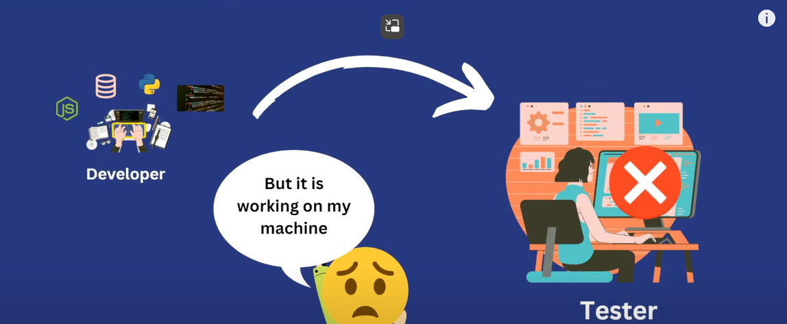

 
 

# `# Docker Tutorial for Beginners  # `

 

[Docker_Tutorial_For_Beginners](https://www.youtube.com/watch?v=OhnTMWmfTBE&t=8158s)

[Dockers_Docs Website Link](https://docs.docker.com/reference/cli/docker/version/)

 

# What is Docker?

- Docker is a tool that allows you to package and run applications in isolated environments called **containers**. Think of a container as a mini-computer with everything your app needs (code, libraries, system tools) bundled together. This makes your app portable and ensures it works the same way on any computer that can run Docker.

- Another Definition of Docker that **Docker** is a containerization platform for developing packaging, shipping, and running applicatios. It provides the ability to run an application in an isolated environment called a container. Makes deployment and development efficient.

## For Example
- Imagine you build a web app on your laptop that needs Node.js and MongoDB. With Docker, you create containers for both Node.js and MongoDB, package them with your app, and deploy it anywhere without worrying if the target system has Node.js or MongoDB installed. Docker ensures your app runs consistently across different machines, from development to production.

# Why need Docker?

- Docker is helpful because it makes it easy to run applications consistently, no matter where they're deployed. Normally, apps might behave differently depending on the operating system, software versions, or libraries on different computers. Docker eliminates these differences by packaging everything the app needs into containers.

## For Example
- Imagine you develop a web app on your laptop, and it works perfectly. But when you try to run it on a server, it crashes because the server has different software versions or missing dependencies. With Docker, you "containerize" the app with all its dependencies, so the same container can be run reliably on your laptop, on a server, or even in the cloud—making it consistent everywhere.

In short, Docker saves time and reduces headaches by preventing "it works on my machine" issues! 

 

# What is a Container?

- In Docker, a container is like a small, self-sufficient "box" that holds everything needed to run an application. It includes the app’s code, its libraries, tools, and settings. Containers keep the app isolated from the rest of the system, making sure it runs the same way no matter where it’s deployed.

**Every containers are isolated thats mean any container can not dependent other container or local machine.**

## For Example
Imagine you create a web app that needs Python 3.9, some libraries, and a specific configuration. In Docker, you can put all these things in a container. This container can then be shared or moved to any computer that has Docker, and the app will run the same way every time, regardless of that computer’s specific setup. 

 

# Architecture of Docker 

- Suppose In our machine, my operating system place on the hardware . When using the docker ultimately docker engine place on our operating system. Like this image:

 

## Running Multiple Version of Same Application Docker
- Running multiple versions of the same application in Docker is simple because each version can be run in its own isolated container. Docker containers don’t interfere with each other, so you can run different versions of an app on the same system without conflicts.

**Benifits**: 
- Using Docker for multiple versions helps you:

  1.  Test compatibility without needing multiple environments.
  2. Run isolated instances side-by-side on the same machine without conflicts.
- Docker makes managing and testing multiple versions of applications easy and conflict-free.

 

# Comparison Docker Vs Virtual Machine(VM)

 

# Main Components of Docker

- Docker File 
- Docker Image 
- Docker Container
- Docker Registry

## Understand this main component by flow diagram :

 

# What is Dockerfile?
- A Dockerfile is a text file with instructions on how to build a Docker image. It’s like a recipe for creating a container with everything an app needs to run—such as code, libraries, and configurations.

## For example: 
Inside the Dockerfile : 
- FROM: Chooses a base image (e.g., Python 3.8).
- COPY: Copies app.py (your code) into the container.
- WORKDIR: Sets the working directory inside the container.
- CMD: Runs the app.py file when the container starts.

# What is Docker Registry ?

- A docker registry is a central repository for storing and distributing Docker images.

 

# What is Docker Hub?

- **Docker Hub** is an online library where Docker users can find, share, and store Docker images. It’s like a public app store for Docker images—offering ready-made images for popular software like databases, web servers, and programming languages.

[Docker Hub website  Link](https://hub.docker.com/explore)

Here the Docker Hub website . In this website, there are many public or private image including docker helps.You can easily pull this image and run this containers.

# Installation Process:

## For windows:

[Docker install for Window website  Link](https://docs.docker.com/desktop/setup/install/windows-install/)

- `first step`: you can search **docker install** any website like: google,microsoft edge, firebase etc 
- Go to docker docs official website.
- Then here firstly check the system requirements then install the docker desktop for Windows.

 

## For Mac :

[Docker install for Mac website  Link](https://docs.docker.com/desktop/setup/install/mac-install/)

- `first step`: you can search **docker install** any website like: google,microsoft edge, firebase etc 
- Go to docker docs official website.
- Then here firstly check the system requirements then install **the docker desktop for Mac with Apple silicon** OR **Docker Desktop for Mac with intel chip.**

 

## For Linux: 
[Docker install for Linux website  Link](https://docs.docker.com/desktop/setup/install/linux/)

- `first step`: you can search **docker install** any website like: google,microsoft edge, firebase etc 
- Go to docker docs official website.
- Then here firstly check the system requirements then install the docker for your type of linux.

 

# Creating a Demo project like Node js based app;
## In this app use some command like this : 

- Here I use Arch Linux Operating system:

1. (Node install)=    **sudo pacman -S node** (-> Command)
2. (Create Demo Project)=   **npx create-react-app myapp**  (->Here myapp is the demo app name if you can any type of name)
3. (next you can go this app directory ? how to do this? here the command you use)=    **cd myapp**  (-> myapp is you app name)
4. (start your npm)=  **npm start**

- In this project, here see the name **Node Module** - all components are contain this file and if you run without this file, you can not run your project.
- Suppose unfortunately delete the **Node module** . how to recover this? very simple just write a command that is - **npm install** and simply recover this. how funny?

# how to use Docker?

## Using Docker there are sequencially process be :

1. **Creating Docker file**: In this docker file we can use some demo operation that: 

        FROM node:20

        WORDIR /myapp

        COPY . .

        RUN npm install

        CMD [ "node","myapp"]

2. **Creating Docker Image**: using terminal we can use command for creating docker image:

     -  **docker build .**             
      
      (-> this means that creating a docker image)

    - **docker images** OR **docker image ls**  
    (---> this means the list of the docker image )

3. **Run the Docker Image in the Container:** 

    -   **docker run imageId**    
       (-->  here every image has unique image id suppose the imageId like that **2f02e42127df**)

    - see the docker Container running :  

       **docker ps**

    - How to stop this Running Container :  
      
       **docker stop Names**           

       (--> How to find this name? firstly command is **docker ps** then copy **the name** and here is this **name**)
    
    - how to access outside the container and how to run this image? Here is the solution: 

        docker run -p 3000:3000 imageId       

        (
            p = port )

     