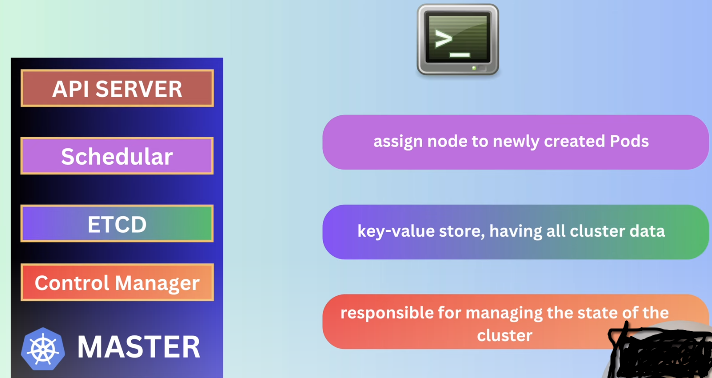
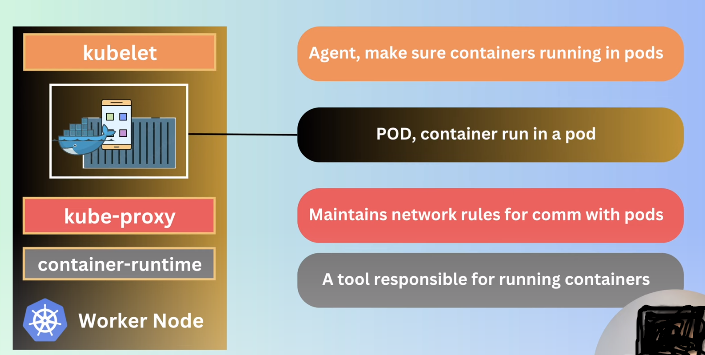

`এতক্ষণ আমরা কি শিখলাম ? `

- Kubectl and minikube install করেছি । 
- Cluster বানিয়েছি । cluster কি জিনিস ঐটা তো আমাদের ব্যাসিক নোট এ আছে । 
- minikube status:

```css
minikube status
minikube
type: Control Plane
host: Running
kubelet: Running
apiserver: Running
kubeconfig: Configured
```
`এখানে, Control Plane বলতে আমাদের যে master node আছে সেইটা বুঝাইতেছে । অর্থাৎ, আমাদের minikube হচ্ছে master node ।  আমরা যেহেতু একই পিঁসিতে কাজ করবো তাই আমরা minikube ব্যবহার করবো । আর, আমাদের control plane and worker node একটা পিঁসিতেই থাকবে । In a master node, we have apiserver, in minikube status our apiserver is running। And kubelet is the component of worker node । Next, আমরা workernode এর POD এ কীভাবে আমাদের application run করাবো সেইটা দেখবো ।  `

<br>
<br>

# `# Master Node: `



<br>

# `# Worker Node: `



<br>
