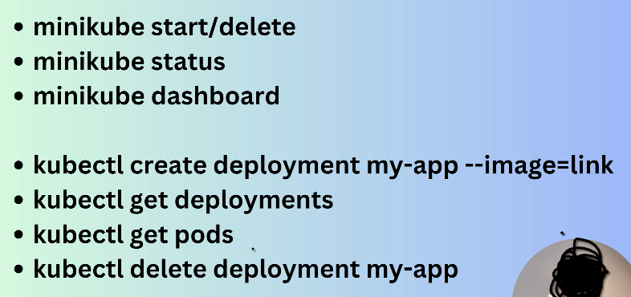

<br>
<br>

# `# Run pod in a workerNode: `

<br>
<br>

`POD এর মধ্যে আমাদের container চলবে । POD  হচ্ছে একটা running instance incluster.`
`Pod এ আমরা এক বা একাধিক container রান করতে পারি এবং container গুলো নিজেদের মধ্যে resources শেয়ার করতে পারে । আচ্ছা চলো docker hub থেকে একটা image  । `


[Docker_Hub_Image_Nginx](https://hub.docker.com/_/nginx)

<br>

---
---
---

<br>


# `# 1.1 Pod এর মধ্যে container চলবে । তাই, আগে POD বানাবো । `


### `--- Step: 01 ---`
```bash
kubectl create deployment my-nginx --image=nginx:latest
```
here,
i) my-nginx আমার দেওয়া নাম । 
ii) Docker repo তে image এর নাম nginx দেওয়া আছে । 
iii) nginx:latest হচ্ছে, version নাম । 


### `--- Step: 02 ---`
**For checking,**

```bash
kubectl get deployments
```
**Output:**
```css
NAME       READY   UP-TO-DATE   AVAILABLE   AGE
my-nginx   1/1     1            1           5m56s
```
**here,** 
i) 1/1 means OKay.


### `--- Step: 03 ---`
**For cheking pod:**

```bash
 kubectl get pods 
```

**output:**
```css
NAME                       READY   STATUS    RESTARTS   AGE
my-nginx-c78685b99-4knfl   1/1     Running   0          10m
```
**here,**
i) my-nginx-c78685b99-4knfl pod name
ii) 1/1 everything is okay.

<br>

---
---
---

<br>

# `# 1.2 See the dashboard of minikube: `

```bash
minikube dashboard
```
**output:**
It will give us a link and by following this link we will go to a websites.
From that we will find all the staus about kubernetes.


<br>
<br>
<br>
<br>

---
---
---

<br>
<br>
<br>


# `#2. How to access the running POD from LocalHOST`


`এখন কথা হচ্ছে, আমাদের যে container আছে সেইটা আমাদের POD এর মধ্যে রান হচ্ছে । এখন যদি আমরা সেই container কে localhost দিয়ে access করতে চাই । তাহলে সেইটা করতে পারবো না । pod এর মধ্যে container, আবার, pod এর মধ্যে cluster থাকার কারণে ।  এখন, এর জন্য আমাদের port binding করতে হবে (যেইটা আমরা docker এও করে থাকি) ।  `


---
---
---

### `<- 2.1: Port Binding In Docker:-> `


### Docker-এ Port Binding কী?

Docker-এ **port binding** হলো এমন একটি প্রক্রিয়া, যেখানে আমরা **Docker container-এর ভিতরের একটি নির্দিষ্ট port**-কে আমাদের **হোস্ট মেশিনের port-এর সাথে লিংক** করি। এটি করার ফলে, আমরা হোস্ট মেশিন থেকে container-এর ভিতরে থাকা অ্যাপ্লিকেশন বা সার্ভিসে সহজেই অ্যাক্সেস করতে পারি।

**উদাহরণ:**

ধরুন, আপনি Docker container-এ একটি `nginx` server রান করছেন, যা container-এর ভিতরে **80 port**-এ রান করছে। আপনি যদি container-এর server-এ হোস্ট মেশিন থেকে অ্যাক্সেস করতে চান, তাহলে আপনাকে port binding করতে হবে।

### Port Binding Syntax

```bash
docker run -p <host-port>:<container-port> <image-name>
```

**উদাহরণ:**

```bash
docker run -p 8080:80 nginx
```

**এখানে:**
- **8080:** হোস্ট মেশিনের port, যেটি আমরা বাইরের থেকে অ্যাক্সেস করতে পারি।
- **80:** container-এর ভিতরে `nginx` server-এর port।
- **nginx:** Docker image-এর নাম।

এখন, আপনি হোস্ট মেশিন থেকে ব্রাউজারে গিয়ে **`http://localhost:8080`** এ গেলে container-এর ভিতরে থাকা `nginx` server দেখতে পাবেন।

### কেন Port Binding দরকার?
1. **অ্যাক্সেস:** হোস্ট মেশিন থেকে container-এর সার্ভিস বা অ্যাপ্লিকেশন অ্যাক্সেস করা।
2. **ট্র্যাফিক:** container-এর ভিতরের সার্ভিসকে বাইরের নেটওয়ার্ক বা ইন্টারনেট থেকে ট্র্যাফিক পাঠানোর জন্য।
3. **টেস্টিং:** container-এর ভিতরে থাকা অ্যাপ্লিকেশন সহজে টেস্ট করা যায়।

### Docker Port Binding না করলে কী হবে?

যদি আপনি port binding না করেন, তাহলে container-এর সার্ভিস কেবল container-এর ভিতরেই সীমাবদ্ধ থাকবে এবং আপনি হোস্ট মেশিন বা অন্য কোনো ডিভাইস থেকে সেটি অ্যাক্সেস করতে পারবেন না।

### Port Binding চেক করার উপায়

```bash
docker ps
```

**Output:**
```css
CONTAINER ID   IMAGE    PORTS                   NAMES
b9a8c9e8d9e0   nginx    0.0.0.0:8080->80/tcp    amazing_nginx
```

এখানে, **0.0.0.0:8080->80/tcp** মানে হলো, হোস্টের **8080 port** bind করা হয়েছে container-এর **80 port**-এর সাথে।

### সংক্ষেপে:

- Port binding ব্যবহার করে আপনি container-এর সার্ভিসকে হোস্ট মেশিন থেকে বা বাইরের নেটওয়ার্ক থেকে অ্যাক্সেস করতে পারবেন।
- এটি Docker container-এর বাইরে অ্যাপ্লিকেশন সার্ভিস এক্সপোজ করার একটি উপায়।


---
---
---

### `<-- 2.2: Port Binding In Kubernetes: --> `

`Port binding করাকে আমরা kubernetes এ service object বলি । `

**command: 01:**
```bash
kubectl expose deployment my-nginx --port=80 --type=LoadBalancer 
```

**output:**
```css
service/my-nginx exposed

```                
**command: 02:** Now we should tell our minikube about the url 
```bash
minikube service my-nginx
```

**command: 03:** To see all the services 
```bash
kubectl get services 
```

### Summary: 




<br>
<br>
<br>
<br>

---
---
---

<br>
<br>
<br>

# `#3. How to delete container from a pod?  `

Kubernetes-এ **একটি চলমান Pod থেকে সরাসরি কন্টেইনার মুছে ফেলা যায় না**। Pod হলো Kubernetes-এর সবচেয়ে ছোট ইউনিট, যা এক বা একাধিক কন্টেইনার নিয়ে কাজ করে। যদি আপনি কন্টেইনার পরিবর্তন করতে চান, সাধারণত আপনাকে পুরো Pod মুছে ফেলে নতুনভাবে তৈরি করতে হবে।

```bash
kubectl delete deployment my-nginx 
```

