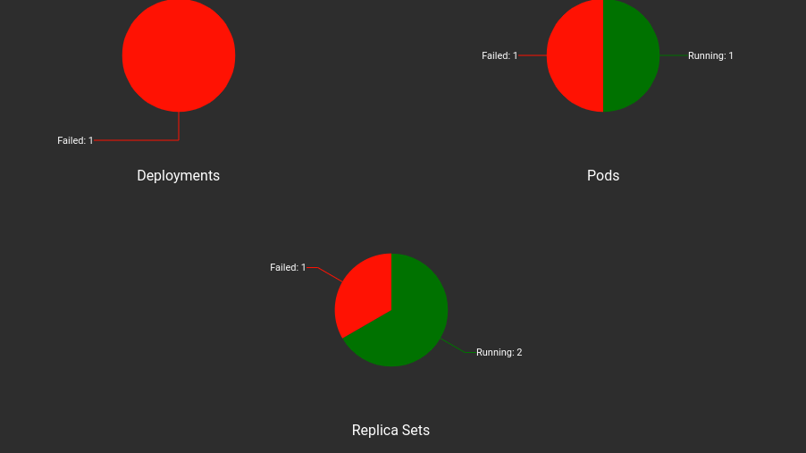

<br>

---

# `#7. Roll Back: `

---

<br>

```bash
kubectl set image deployment my-web-app nginx=yasin005/nginx:03 
```
**output:**

```css
deployment.apps/my-web-app image updated
```
`কিন্তু মজার ব্যাপার হচ্ছে, আমাদের 03 version নামে কোন ভার্সন নেই । এখন, kubernetes আগের মতো 03 ভার্সনে switch করবে না । কিন্তু, "kubectl get pods" দেখতে পাবো, ImagePullBackOff । এখন, এইটাকে সরানোর জন্য আমাদের roll out করতে হবে ।  `

```bash
kubectl get pods                                               
```

**OUTPUT:**
```css
NAME                          READY   STATUS             RESTARTS        AGE
my-web-app-69dc9dbc85-pbm6m   0/1     ImagePullBackOff   0               4m23s
my-web-app-77879848cb-xmz6g   1/1     Running            1 (7h37m ago)   8h
```



`আমাদের আগের, ভার্সন চালু আছে । কিন্তু, আমরা যে wrong version দিয়েছি তার একটা blueprint এখনো আছে । যেইটা আমরা উপরের minikube dashboard থেকে দেখতে পাচ্ছি । এটাকে নিচের command দিবো ।  `

```bash
kubectl rollout undo deployment my-web-app
```
`my-web-app` -> `হচ্ছে আমার deployment এর নাম । `


